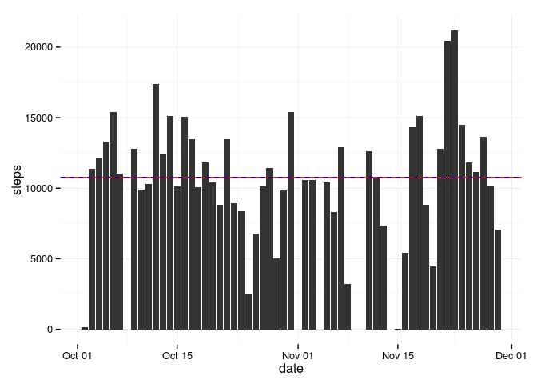
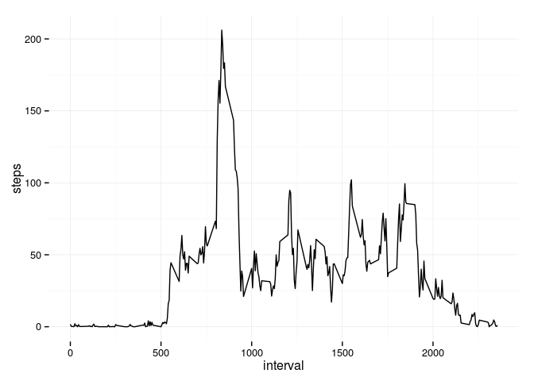
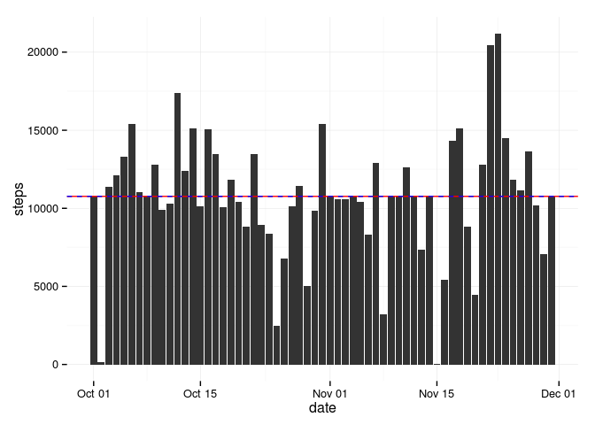
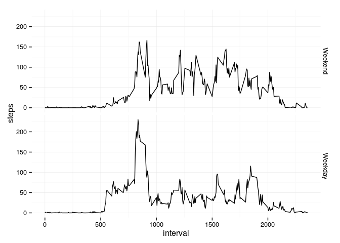

# Reproducible Research: Peer Assessment 1


## Loading and preprocessing the data

```r
setwd("~/Repos/RepData_PeerAssessment1/")
Sys.setlocale("LC_ALL", 'en_US.UTF-8')
library(ggplot2)
```

```r
# Create data directory
if(!file.exists("./data/")){
    dir.create("./data/")}
# Extract File
if(!file.exists("./data/data.csv")) {
  unzip("activity.zip", exdir = "./data/") 
  }
# Read the file
data <- read.csv("./data/activity.csv")
data$date <- as.Date(data$date, format = "%Y-%m-%d")
```

## What is mean total number of steps taken per day?

1. *Make a histogram of the total number of steps taken each day*

```r
daily.steps <- aggregate(steps ~ date, data, FUN = sum)

ggplot(daily.steps) + geom_bar(aes(date,steps),stat="identity") + theme_minimal() + 
  geom_hline(yintercept=mean(daily.steps$steps),colour="red") + 
  geom_hline(yintercept=median(daily.steps$steps),colour="blue",linetype = "dashed")  
```

 

2. *Calculate and report the mean and median total number of steps taken per day*

```r
daily.steps.mean <- mean(daily.steps$steps)
daily.steps.median <- median(daily.steps$steps)
```
**Mean:** 1.0766189\times 10^{4}  
**Median:** 10765


## What is the average daily activity pattern?
1. *Make a time series plot (i.e. type = "l") of the 5-minute interval (x-axis) and the average number of steps taken, averaged across all days (y-axis)*

```r
steps.interval.mean <- aggregate(steps ~ interval, data, FUN = mean)
ggplot(steps.interval.mean) + geom_line(aes(interval,steps)) + theme_minimal()
```

 

2. *Which 5-minute interval, on average across all the days in the dataset, contains the maximum number of steps?*

```r
steps.interval.mean$interval[which.max(steps.interval.mean$steps)]
```

```
## [1] 835
```

## Imputing missing values

1. *Calculate and report the total number of missing values in the dataset (i.e. the total number of rows with NAs)*

```r
sum(is.na(data))
```

```
## [1] 2304
```

2. *Devise a strategy for filling in all of the missing values in the dataset. The strategy does not need to be sophisticated. For example, you could use the mean/median for that day, or the mean for that 5-minute interval, etc.*

The strategy will be to assign the mean for that 5-minute interval. I will calculate the mean for all the intervals. After that, for each observation with missing steps, I will look for the interval value and assign
the step value in the median dataframe with the same interval value.

3. *Create a new dataset that is equal to the original dataset but with the missing data filled in.*

```r
complete.data <- data
# For each observation
for (i in 1:nrow(complete.data)) {
  # In which the step is NA
  if (is.na(complete.data[i,"steps"])) {
    # Assign the step value using as a reference the steps.interval.mean data frame
    complete.data[i,"steps"] <- steps.interval.mean[steps.interval.mean$interval == complete.data[i,"interval"], "steps"] 
  }
}

head(complete.data)
```

```
##       steps       date interval
## 1 1.7169811 2012-10-01        0
## 2 0.3396226 2012-10-01        5
## 3 0.1320755 2012-10-01       10
## 4 0.1509434 2012-10-01       15
## 5 0.0754717 2012-10-01       20
## 6 2.0943396 2012-10-01       25
```

```r
sum(is.na(complete.data))
```

```
## [1] 0
```

4. *Make a histogram of the total number of steps taken each day and Calculate and report the mean and median total number of steps taken per day.*
Make a histogram of the total number of steps taken each day with the complete data

```r
complete.daily.steps <- aggregate(steps ~ date, complete.data, FUN = sum)

ggplot(complete.daily.steps) + geom_bar(aes(date,steps),stat="identity") + theme_minimal() + 
  geom_hline(yintercept=mean(complete.daily.steps$steps),colour="red") + 
  geom_hline(yintercept=median(complete.daily.steps$steps),colour="blue",linetype = "dashed")  
```

 

Calculate and report the mean and median total number of steps taken per day with the complete data

```r
complete.daily.steps.mean <- mean(complete.daily.steps$steps)
complete.daily.steps.median <- median(complete.daily.steps$steps)
```
**Mean:** 1.0766189\times 10^{4}  
**Median:** 1.0766189\times 10^{4}

5. *Do these values differ from the estimates from the first part of the assignment? What is the impact of imputing missing data on the estimates of the total daily number of steps?*

Mean doesn't differ from the estimates becase I was adding mean values to the data set which don't impact on the statistics.  

Nevertheless, the Median value did change. It became the same value as the mean.

## Are there differences in activity patterns between weekdays and weekends?
1. *Create a new factor variable in the dataset with two levels – “weekday” and “weekend” indicating whether a given date is a weekday or weekend day.*

```r
isWeekday <- function(days){
  values <- NULL
  for(i in days){
    if(i == "Sunday" | i == "Saturday"){
      values <- c(values, FALSE)
    }      
    else{
      values <- c(values, TRUE)
    }      
  }
  values
}

complete.data$day <-weekdays(complete.data$date)
complete.data$weekday <- as.factor(isWeekday(complete.data$day))
```

2. *Make a panel plot containing a time series plot (i.e. type = "l") of the 5-minute interval (x-axis) and the average number of steps taken, averaged across all weekday days or weekend days (y-axis). See the README file in the GitHub repository to see an example of what this plot should look like using simulated data.*

```r
# steps.weekdays
d <- aggregate(steps ~ interval + weekday, complete.data, FUN = mean)
levels(d$weekday) <- c("Weekend","Weekday")
ggplot(d) + geom_line(aes(interval,steps)) + facet_grid(weekday ~ .) + theme_minimal()
```

 
